# 🏝️ Resort Booking

A modern iOS application that helps users check the **real-time availability and booking status of resorts**. The application provides two different access levels—**Admin** and **User**—to manage resort information and bookings efficiently.

---

# 📱 Features

## 🔐 Authentication

- Secure login using **Phone Number Authentication**
- OTP verification using **Firebase SMS Authentication**
- Only authenticated users can access the application

---

# 👥 User Roles

## 👤 User

Users can:

- Browse all available resorts
- View detailed resort information
- Check real-time booking availability
- View booked dates and available dates
- Check booking timings
- View resort location on map
- Get navigation directions using Maps
- Like/Favorite resorts
- Submit and update feedback
- View ratings given by other users
- See total views for each resort

---

## 👨‍💼 Admin

In addition to all user features, admins can:

- Add new resorts
- Update existing resort information
- Manage resort bookings
- Add or remove bookings
- Update booking schedules
- Keep resort availability updated in real-time

---

# 🏠 Home Screen

The Home screen displays the list of all resorts with their basic information.

Users can:

- Browse available resorts
- Open resort details
- View liked resorts
- See real-time availability information

---

# 🏢 Resort Details

Each resort contains detailed information including:

- Resort Name
- Address
- Description
- Image Gallery
- Contact Number
- Google Map Location
- Latitude & Longitude
- Seating Capacity
- Hall Size
- AC Availability
- Room Availability
- Parking Capacity
- Power Backup Availability
- Electricity Bill (Per Unit)
- Total Views
- User Ratings
- User Feedback

---

# 📅 Booking Calendar

The application provides an interactive calendar showing:

- ✅ Available Dates
- ❌ Booked Dates

Users can tap on a booked date to view:

- Booking Start Time
- Booking End Time

This helps users easily identify the availability of a resort before contacting the owner.

---

# 🗺️ Maps & Navigation

Each resort includes map support.

Features:

- View resort location on map
- Get navigation directions
- Redirect to the default Maps application for route guidance from the user's current location

---

# ❤️ Favorites

Users can mark resorts as favorites by tapping the ❤️ heart icon.

Features:

- Save favorite resorts
- Access all liked resorts from the Favorites section
- Favorites are maintained individually for each user

---

# ⭐ Ratings & Reviews

Users can share their experience by submitting feedback.

Features:

- One feedback per user for each resort
- Feedback can be updated multiple times
- Ratings are displayed as stars
- Reviews are visible to all users
- Average rating helps users make better decisions

---

# 👀 View Counter

Every resort maintains a view count.

Features:

- Counts total visits to each resort
- Visible to all users
- Helps identify popular resorts

---

# 👤 User Profile

View personal profile information.

Update user details:

- Name
- Email Address
- Residential Address
- Upload or change profile picture.
- Mobile number is non-editable as it is used for authentication via Firebase Phone OTP.
- Access application settings from the profile screen.

---

# 🌐 Multi-Language Support

Supports multiple languages for a localized user experience.

Language can be changed directly from the Profile section.

Available languages:

- 🇬🇧 English
- 🇮🇳 Hindi
- 🇮🇳 Marathi
- 
Language preference is applied throughout the application.

---

# 🔍 Search & Filter

- Search resorts by resort name.

- Quickly find a specific resort from the home screen.
  
- Improves navigation when multiple resorts are available.

---

# 🔄 Real-Time Booking Updates

Admins manage bookings from the application.

Whenever a booking is added, updated, or removed:

- Resort availability is updated instantly
- Users can view the latest booking status
- Calendar reflects real-time availability

---

# 🛠️ Tech Stack

## iOS

- Swift
- SwiftUI
- VIPER Architecture
- Firebase Authentication
- Google Maps
- MapKit
- URLSession
- Async/Await

---

## Backend

- Spring Boot
- REST APIs
- MySQL Database

The backend exposes REST APIs which are consumed by the iOS application.

---

# 🔥 Firebase

Firebase is used for:

- Phone Number Authentication
- OTP Verification (SMS Authentication)

---

# 🗄️ Database

The backend uses **MySQL** for storing:

- User Information
- Resort Details
- Booking Information
- Feedback
- Ratings
- Favorites
- View Counts

---

# 🌐 API

The backend is developed using **Spring Boot**.

Responsibilities include:

- User Authentication
- Resort Management
- Booking Management
- Feedback APIs
- Rating APIs
- Favorites APIs
- View Count APIs

The iOS application communicates with the backend through REST APIs.

---

# 🚀 Current Status

- Backend is currently running on **localhost**
- iOS application consumes APIs from the local backend
- Firebase Authentication is fully integrated

---

# 📸 Application Modules

- Login
- OTP Verification
- Home
- Resort Details
- Booking Calendar
- Maps & Navigation
- Favorites
- Feedback & Ratings
- Admin Dashboard
- Booking Management

---

# 🎯 Future Improvements

- Push Notifications
- Online Payment Integration
- Booking Requests
- Admin Analytics Dashboard
- Cloud Deployment
- Reservation History
- Booking Cancellation

---

# 📱 Preview

# 📱 Frontend Screenshots (iOS Application)

  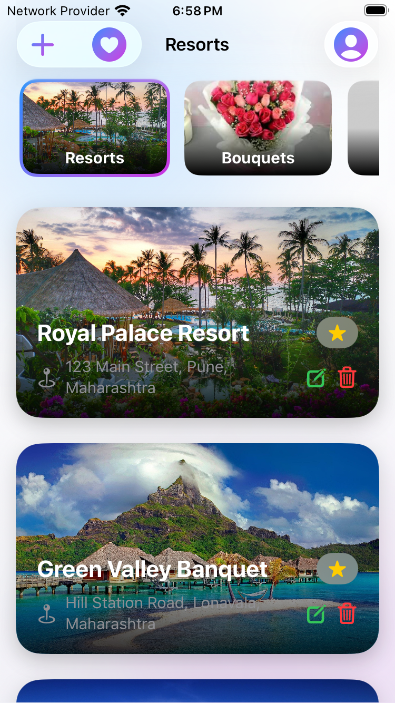 
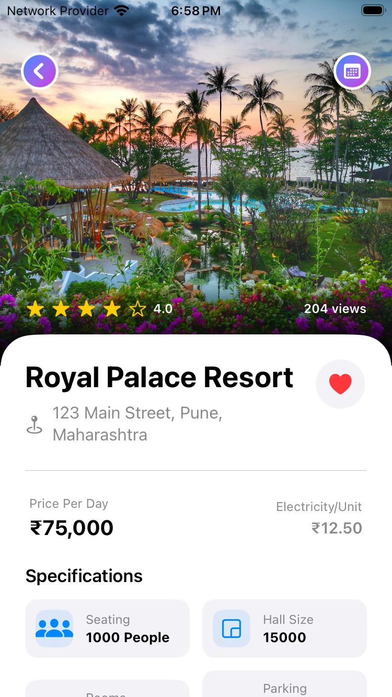 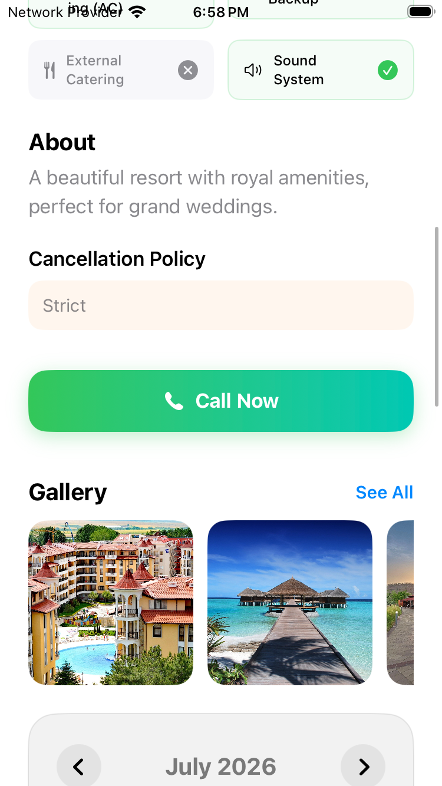 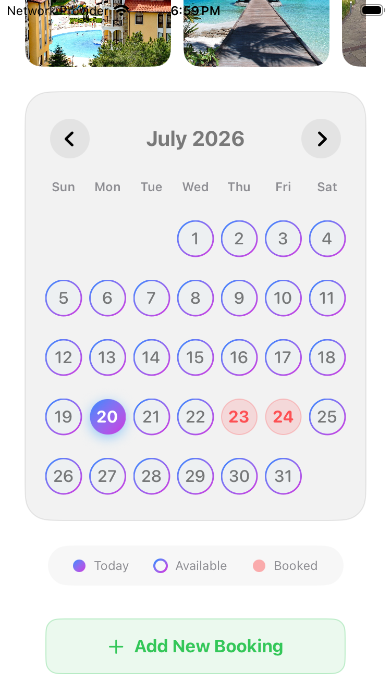
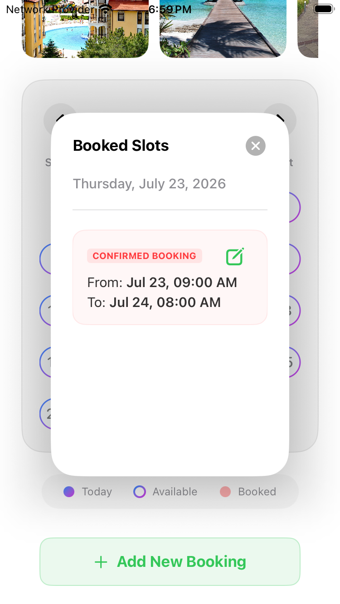 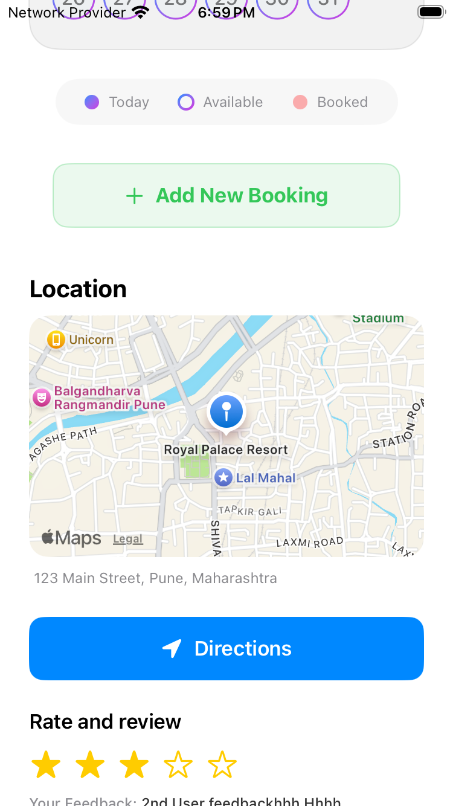 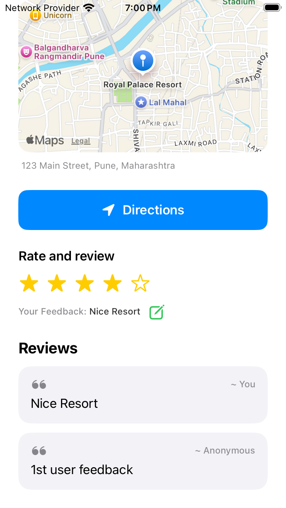
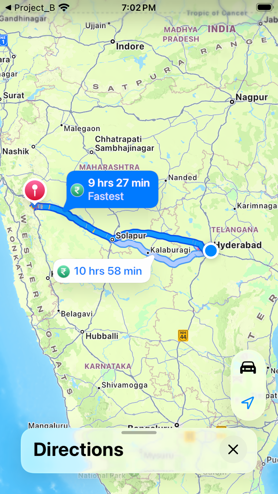 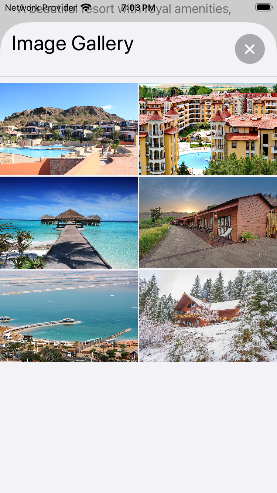 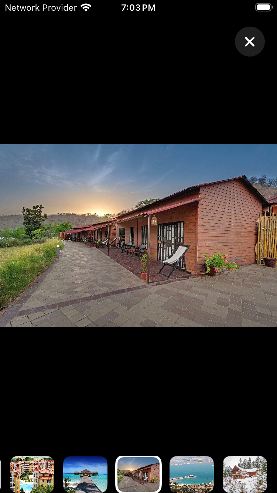 
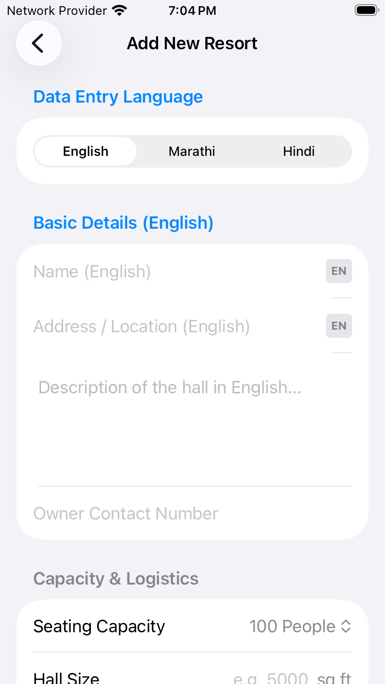 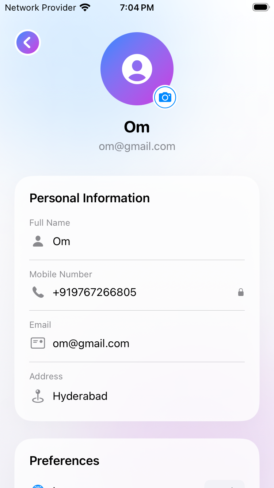 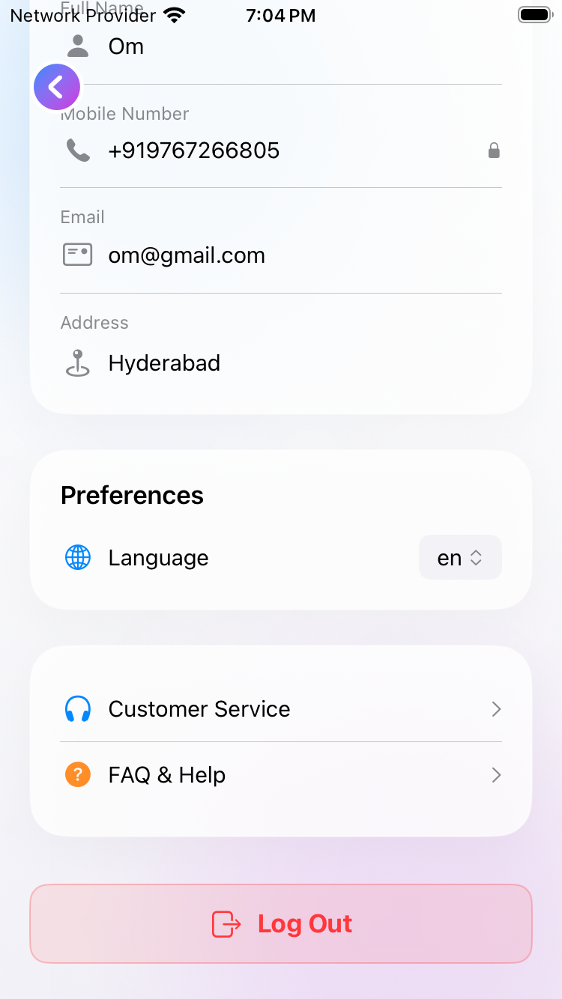
 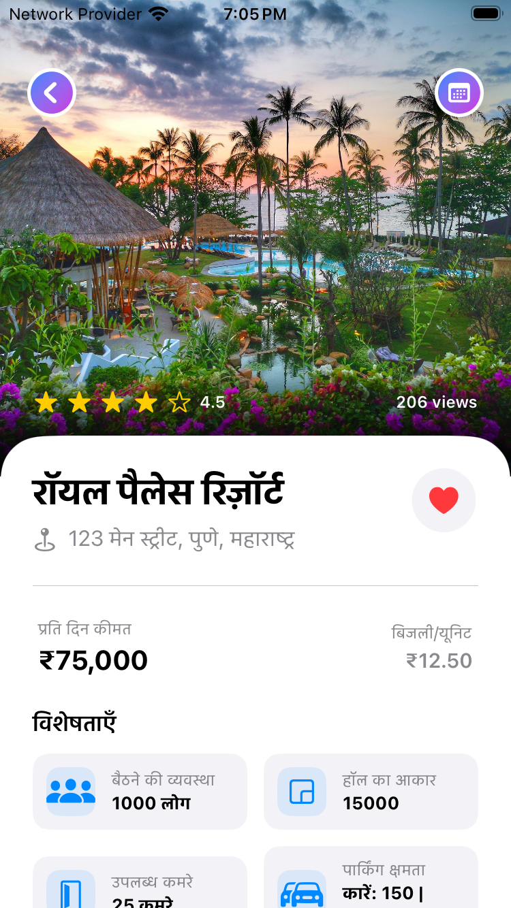

# Backend (Spring Boot)

# Database

---

# 👨‍💻 Author

**Om Makode**

Native iOS Developer

---

